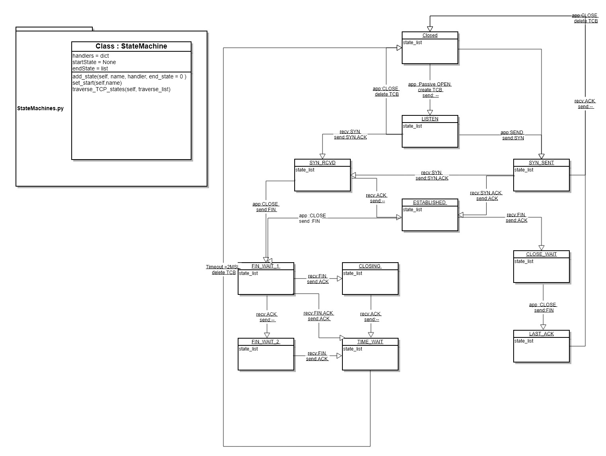

# 접근 방식

내용에 대한 이해 필수 처음 접근 방식은 생각을 다양하게 뻗어나가는 것에 주력하였다.

http://ozt88.tistory.com/8  내용을 참조한 후

유한 상태 기계의 목적을 파악 하였다.

이후 파이썬에서 StateMachine 이라는 클래스를 구축하고 해당 클래스에서는 

1. 핸들러와 딕셔너리 형태로 상태들을 저장 
2. 종료 시점을 저장할 수 있는 기능 
3. 처음 시작포인트
4. 동작 함수

를 구현하여 이를 FSM에 넘기는 방식으로 설계를 하였다.

FSM에서는 각 상태와 그 분기점과 다시 어느 상태로 전이되는지, 그리고 해당 상태가 마지막 시점이면 바로 프로세스의 마지막이라는 것을 
알려주고 빠져나오는 방식으로 설계하였다.

하나의 py 파일이 아닌 2개의 py 파일로 나뉜 것은 클래스 부분과 실제 작동 부문을 나누기 위함이며 if __name__ == "__main__":을 통해 

실행 파일을 열거하였으며 추후 유지 보수 (상태 추가 또는 기타 상태 제거)를 편리하게 하기 위함이다. (만약 FSM을 또 다른 모듈로 사용할 시에는
if __name__ == "__main__": 을 작성할 필요가 없다)

예를 들어 새로운 상태가 추가되면 새로운 상태 함수와 main 밑에 추가를 해주면 끝나게 된다.

# 클래스 다이어그램

