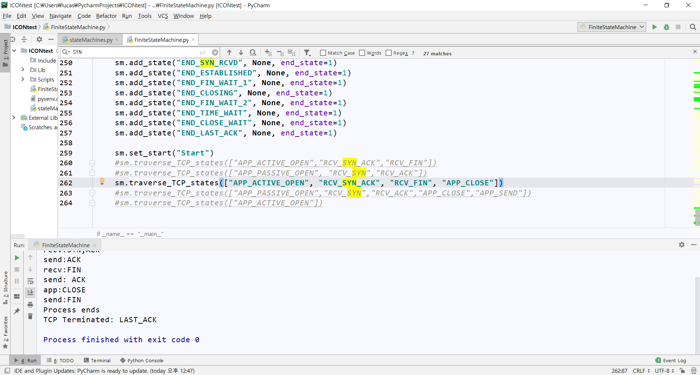

# 실행방법
==========



1. StateMachines.py 와 FiniteStateMachine.py 를 만든다.
2. FiniteStateMachine.py는 StateMachines.py의 클래스(모듈)을 import 해서 사용하기 때문에 StateMachines.py가 꼭 있어야 한다.
3. StateMachines.py 에서 main 밑에 StateMachine을 연결하여 traverse_TCP_states()안에 프로세스를 리스트 형태로 작성해서 사용하면 된다.
4. 주의할 점은 main 밑에  add_state - add_state(end_state=1) - start - traverse_TCP_state 형태로 작성해야한다.


# 해석
=======

```python
# 클래스 생성하여 작성
class StateMachine:
    def __init__(self):
        #handlers 에 딕셔너리 형태로 저장 추후 add_state에 'name(상태 이름) : 동작 함수' 형태로 정의됨
        self.handlers ={}    
        
        #상태 초기화
        self.startState = None
        
        #마지막 상태(리스트로 표현하여 저장해놓음)
        self.endState = []

    #end_state 가 중요(default False로 두었음)
    def add_state(self, name, handler, end_state = 0 ):
        name = name.upper()  #상태가 대문자로 되어있어서 소문자 작성에 대한 방지
        self.handlers[name] = handler #딕셔너리 형태로 , 키:값 
        if end_state:  
            self.endState.append(name)   #만일 end_state가 True 되서  종료가 되게 되면 endState에 해당 상태 이름 추가
 
    #프로세스 시작
    def set_start(self,name):
        self.startState = name.upper()
    
    #중요 메인 함수 
    
    def traverse_TCP_states(self, traverse_list):
        try:
            handler = self.handlers[self.startState]

        except:
            raise Exception(".set_start() shoulbe called before .run , Mendatory")

        #종료 상태가 하나라도 없을 경우
        if not self.endState:
            raise Exception("at least one state must be an end_state")

        while True:
            (newState, traverse_list) = handler(traverse_list)
            if newState.upper() in self.endState:
                stateReturn = newState.split('_', 1)
                if stateReturn == ["ERROR"]:
                    print("TCP Terminated:", "ERROR")
                else:
                    print("TCP Terminated:", stateReturn[1])
                break
            else:
                handler = self.handlers[newState.upper()]
```
